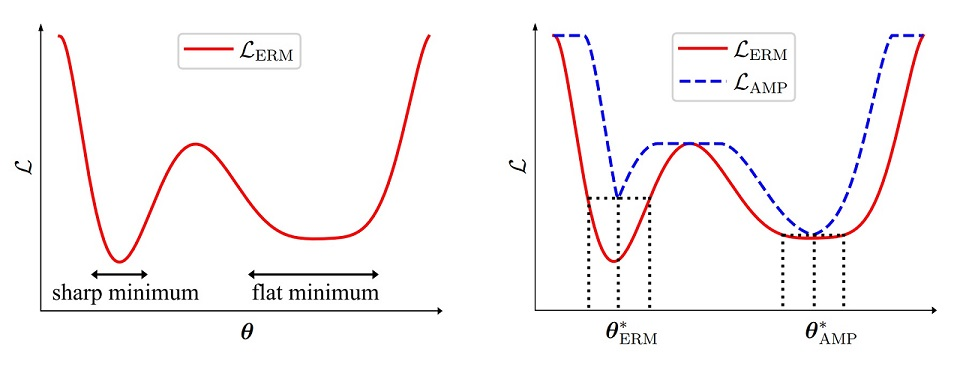

# AMP-Regularizer


Code for our CVPR 2021 paper "Regularizing Neural Networks via Adversarial Model Perturbation".

You can download the paper via: [[ArXiv]](https://arxiv.org/abs/2010.04925) [[PapersWithCode]](https://paperswithcode.com/paper/regularizing-neural-networks-via-adversarial).

## One-Sentence Summary

Adversarial Model Perturbation (AMP) effectively improves the generalization performance of deep models by minimizing an "AMP loss" that can find flat local minima via applying a "worst" norm-bounded perturbation on the model parameter.



## Abstract

Effective regularization techniques are highly desired in deep learning for alleviating overfitting and improving generalization. This work proposes a new regularization scheme, based on the understanding that the flat local minima of the empirical risk cause the model to generalize better. This scheme is referred to as adversarial model perturbation (AMP), where instead of directly minimizing the empirical risk, an alternative "AMP loss" is minimized via SGD. Specifically, the AMP loss is obtained from the empirical risk by applying the "worst" norm-bounded perturbation on each point in the parameter space. Comparing with most existing regularization schemes, AMP has strong theoretical justifications, in that minimizing the AMP loss can be shown theoretically to favour flat local minima of the empirical risk. Extensive experiments on various modern deep architectures establish AMP as a new state of the art among regularization schemes. 

## Requirement

- Python 3.7
- Torch 1.6.0
- TorchVision 0.7.0
- NumPy 1.18.5
- Pillow 6.1.0

## Preparation

### Clone

```bash
git clone https://github.com/**/***.git
```

### Create an anaconda environment [Optional]:

```bash
conda create -n amp python=3.7
conda activate amp
pip install -r requirements.txt
```

## Usage

### Training

#### ERM

```bash
python main.py --dataset [dataset] --model [architecture] --method base
```

#### Dropout

```bash
python main.py --dataset [dataset] --model [architecture] --method base --dropout [drop_rate]
```

#### Label smoothing

```bash
python main.py --dataset [dataset] --model [architecture] --method base --smoothing [smoothing_coefficient]
```

#### Flooding

```bash
python main.py --dataset [dataset] --model [architecture] --method base --flooding [flood_level]
```

#### MixUp

```bash
python main.py --dataset [dataset] --model [architecture] --method mixup --mixup_alpha [mixup_alpha] [mixup_alpha]
```

#### Adversarial Training

```bash
python main.py --dataset [dataset] --model [architecture] --method adv --adv_eps [adv_eps] --adv_iter [adv_iter]
```

#### RMP

```bash
python main.py --dataset [dataset] --model [architecture] --method rmp --epsilon [epsilon]
```

#### AMP

```bash
python main.py --dataset [dataset] --model [architecture] --method amp --epsilon [epsilon] --inner_lr [inner_lr] --inner_iter [inner_iter]
```

#### AMP with Cutout

```bash
python main.py --dataset [dataset] --model [architecture] --method amp --epsilon [epsilon] --inner_lr [inner_lr] --inner_iter [inner_iter] --cutout
```

#### AMP with AutoAugment

```bash
python main.py --dataset [dataset] --model [architecture] --method amp --epsilon [epsilon] --inner_lr [inner_lr] --inner_iter [inner_iter] --autoaug
```

## File Specifications

- **models**: Description for popular model architectures.
- **attacks.py**: Used functions for adversarial training.
- **data_utils.py**: Used functions for data preprocessing.
- **loss_func.py**: Loss function for optimizing the models.
- **main.py**: Scripts for training the models.
- **trainer.py**: Implementation for different regularization schemes.

## Citation

If this work is helpful, please cite as:

```bibtex
@inproceedings{zheng2020regularizing,
  title={Regularizing Neural Networks via Adversarial Model Perturbation},
  author={Zheng, Yaowei and Zhang, Richong and Mao, Yongyi},
  booktitle={{CVPR}},
  year={2021}
}
```

## Acknowledgements

This work is supported partly by the National Key Research and Development Program of China, by the National Natural Science Foundation of China, by the Beijing Advanced Innovation Center for Big Data and Brain Computing (BDBC), by the Fundamental Research Funds for the Central Universities, by the Beijing S&T Committee and by the State Key Laboratory of Software Development Environment. The authors specially thank Linfang Hou for helpful discussions.

## Contact

hiyouga [AT] buaa [DOT] edu [DOT] cn

## License

MIT
